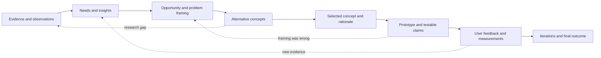
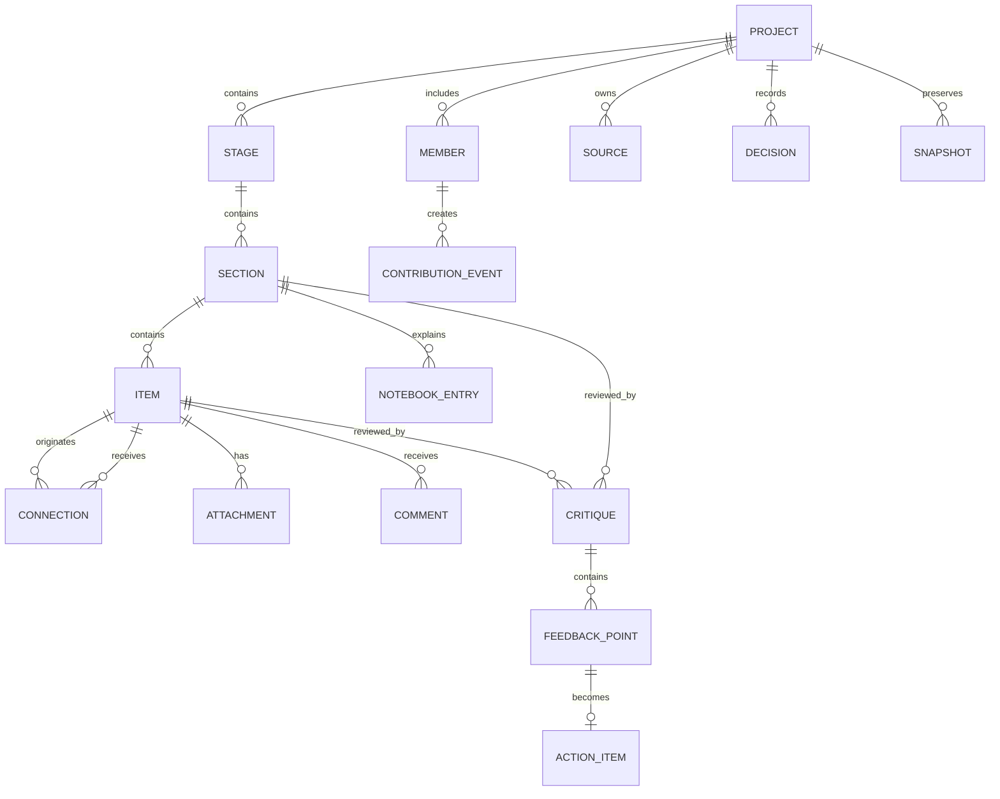

# 4D Design Studio

> Working title: an AI-critiqued design thinking workspace that helps people move from an early opportunity to a tested prototype while preserving the evidence, reasoning, feedback, and decisions behind the work.

**Document status:** Product definition and implementation brief  
**Version:** 1.0  
**Primary framework:** Discover, Define, Develop, Deliver  
**Core interaction model:** Spatial canvas + linked notebook + stage-specific AI critic

---

## 1. Executive summary

4D Design Studio is a collaborative design thinking platform for students, educators, project teams, and independent creators. It combines the open, visual freedom of a Miro-style board with structured guidance based on the four stages of the Double Diamond:

1. **Discover** - understand people, context, needs, and the opportunity space.
2. **Define** - synthesize the research and frame a focused, evidence-backed challenge.
3. **Develop** - generate, compare, model, and improve possible solutions.
4. **Deliver** - prototype, test, iterate, and communicate a validated outcome.

Each stage is a distinct workspace, but the process is not a one-way checklist. Users can move backward, revisit assumptions, branch into alternatives, and show how ideas evolve. Every workspace can contain user-created sections such as a brainstorming area, stakeholder map, persona, site analysis, problem statement, concept comparison, prototype plan, or test report.

Each section has three connected surfaces:

- a **visual board** for notes, media, diagrams, grouping, and connections;
- a **section notebook** for long-form thinking, evidence, assumptions, decisions, and reflection;
- a **contextual AI critic** trained for the current 4D stage and limited to the selected section, linked evidence, and project brief.

The AI does not replace the designer or automatically approve the work. It identifies strengths, gaps, weak assumptions, missing evidence, contradictions, and useful next actions. The human team decides what to accept and when to progress.

### Product promise

**Turn scattered design activity into a visible, connected, critique-driven process from idea to prototype.**

### Guiding principle

**Human drives the process; AI expands the design space.**

The product should accelerate feedback, connect knowledge across disciplines, and encourage creative transformation while keeping human judgment, empathy, responsibility, and authorship at the center.

---

## 2. Background and opportunity

Design thinking work is often split across whiteboards, documents, slides, survey tools, chat threads, prototype files, and assessment portals. A team may finish with a polished final presentation but lose the reasoning that connected observations to insights, insights to the problem statement, and the problem statement to the chosen solution.

General-purpose whiteboards support visual collaboration but do not understand the design process. General-purpose AI chats can give advice but usually lack the board's local context, the project's evidence chain, and the expectations of the current design stage. This creates several problems:

- teams jump to a solution before understanding the people and context;
- personas and problem statements are based on assumptions instead of evidence;
- useful research becomes disconnected from later decisions;
- brainstorming converges too early on the first plausible idea;
- prototypes are produced without a clear testable claim;
- feedback is generic because the reviewer cannot see the full reasoning trail;
- AI-generated material can be mistaken for verified research;
- final reports require teams to reconstruct weeks of work manually;
- educators and reviewers see the output but not the quality of the process.

4D Design Studio addresses this gap by making the design process itself the main product. It gives teams freedom to think spatially while adding just enough structure, critique, traceability, and reflection to improve the quality of their decisions.

---

## 3. Product vision

Create a workspace where any team can:

- begin with an open-ended challenge;
- investigate real people, environments, systems, and existing solutions;
- turn evidence into a focused opportunity;
- generate and compare genuinely different concepts;
- build and test prototypes;
- receive useful stage-aware critique throughout the process;
- revisit earlier stages without losing history;
- explain not only **what** was designed, but **why**.

The finished project should read like a connected argument:



---

## 4. Goals and non-goals

### 4.1 Product goals

- Provide a clear four-stage project structure without forcing a rigid linear process.
- Allow users to create their own thinking sections and methods within every stage.
- Combine visual, textual, media, and data-based evidence in one workspace.
- Preserve links between source evidence, interpretations, decisions, concepts, and tests.
- Give every stage its own AI critic with a distinct role and evaluation lens.
- Make AI feedback specific, constructive, explainable, and actionable.
- Help teams expose weak assumptions before those assumptions become expensive decisions.
- Support individual work, team collaboration, educator review, and rubric-based assessment.
- Generate presentation- and report-ready documentation from the work already on the board.
- Encourage iteration, reflection, ethical research, inclusion, and responsible AI use.

### 4.2 Non-goals for the first release

- Replacing human interviews, observation, site visits, or user testing.
- Treating AI-generated personas or findings as real research evidence.
- Automatically grading a project without human review.
- Building full CAD, 3D modeling, simulation, survey recruitment, or video editing tools.
- Becoming a general-purpose document editor or project-management suite.
- Automatically moving a team between stages or selecting a final solution.
- Guaranteeing that an uploaded source, user claim, or AI statement is factually correct.

---

## 5. Target users

### 5.1 Student design team

Needs a shared place to plan research, develop personas, analyze a site, frame a challenge, generate concepts, build a prototype story, divide work, and prepare assessed deliverables. Values clear templates and feedback that explains how to improve.

### 5.2 Independent designer or founder

Needs a repeatable process that prevents premature solution-building. Values an always-available critical partner, an evidence trail, and a compact export for stakeholders.

### 5.3 Facilitator or educator

Needs to understand how a team reached its outcome, leave feedback at the right point, compare progress against a rubric, and identify teams that are stuck or skipping research.

### 5.4 External reviewer or domain expert

Needs a focused review view with relevant evidence, questions, constraints, and prior decisions without navigating the entire board.

### 5.5 Organization or innovation team

Needs consistent design practice across projects, reusable templates, governance for sensitive research, and an audit trail of human and AI contributions.

---

## 6. Experience principles

1. **Structured freedom** - the 4D stages provide orientation; users control the sections, methods, and order inside them.
2. **Evidence before confidence** - the interface distinguishes observations, source material, interpretation, assumptions, and AI suggestions.
3. **Critique, not completion** - the AI's default job is to strengthen human work, not silently produce the answer.
4. **Local context first** - feedback is anchored to the selected item or section and only expands to the whole project when asked.
5. **Show the reasoning trail** - every major conclusion can link backward to evidence and forward to a decision or test.
6. **Diverge and converge visibly** - the product protects exploration while making selection criteria explicit.
7. **Iteration is progress** - going backward is shown as learning, not failure.
8. **Human approval is final** - an AI cannot accept a critique, change project content, close a stage gate, or submit work.
9. **Quiet until useful** - the AI should not interrupt every edit. It offers lightweight signals and performs full reviews on demand or at agreed checkpoints.
10. **Inclusive by default** - templates and critique consider accessibility, missing stakeholders, power differences, bias, equity, and unintended consequences.

The stage mindsets supplied with the project concept are reflected throughout the experience:

- Discover with **empathy**.
- Define with **mindfulness**.
- Develop with **joyfulness**.
- Deliver with **non-attachment**, so testing can change or reject a favored idea.

---

## 7. Core product structure

### 7.1 Project home

The project home contains:

- project title, challenge, team, timeline, and status;
- uploaded brief, reference material, rubric, constraints, and desired outcomes;
- a visual 4D progress map;
- recent decisions, unresolved questions, risks, and AI review history;
- navigation into Discover, Define, Develop, and Deliver;
- an evidence and source library shared by all stages;
- export and presentation controls.

### 7.2 Four stage workspaces

Each stage is a separate canvas with its own color, default templates, readiness criteria, and AI critic. A persistent stage strip shows the project from end to end. Users may move freely between stages and can create visible return links such as "Deliver test result changed Define problem statement."

Suggested stage colors based on the supplied 4D reference:

| Stage | Color | Core movement | Default mindset |
|---|---|---|---|
| Discover | Red | Diverge into the opportunity space | Empathy |
| Define | Amber | Converge on the opportunity and statement | Mindfulness |
| Develop | Green | Diverge into solution concepts | Joyfulness |
| Deliver | Blue | Converge through prototyping and testing | Non-attachment |

Color must always be paired with text or an icon so the experience remains accessible.

### 7.3 Sections: the unit of thinking

A **section** is a user-created frame representing one thinking activity. Examples include "Primary research," "Persona: Mei," "Site analysis," "How might we statements," "Concept sprint," and "Prototype test 02."

Every section contains:

- **Canvas surface** - cards, notes, drawings, arrows, groups, images, files, embeds, and tables.
- **Notebook drawer** - purpose, method, long-form notes, evidence, assumptions, decisions, reflections, and citations.
- **AI critic rail** - stage-specific review, questions, strengths, concerns, and next actions.
- **Section header** - owner, status, tags, due date, method, linked sections, and last review time.
- **History** - versions, comments, accepted or dismissed critiques, and decision records.

The notebook can open beside the board or "behind" the section as a focused detail view. This preserves a clean spatial board while giving complex reasoning enough depth.

### 7.4 Item types

Users can add the following items to a section:

| Item | Purpose |
|---|---|
| Sticky note | Short observation, idea, question, or insight |
| Text card | Structured or long-form content |
| Evidence card | Quote, measurement, photo, source excerpt, or field note with provenance |
| Assumption card | An unverified belief that should later be tested |
| Insight card | An interpretation synthesized from linked evidence |
| Decision card | Choice, criteria, owner, date, rationale, and rejected alternatives |
| Question card | An unresolved research or design question |
| Risk card | Risk, likelihood, impact, mitigation, and owner |
| Metric card | Baseline, target, measurement method, and result |
| File or media | Image, PDF, audio, video, dataset, slide, or prototype file |
| Table | Structured research, comparison, prioritization, or test results |
| Embed or link | External prototype, model, form, source, or dashboard |
| AI feedback card | A saved critique or question that remains separate from user-authored content |

Every item is labeled by authorship: **human**, **AI suggestion**, **imported source**, or **system generated**.

### 7.5 Typed connections

Arrows are more than visual decoration. A user can assign a meaning to a connection:

- supports;
- derived from;
- contradicts;
- affects;
- belongs to;
- addresses;
- constrains;
- inspired by;
- tests;
- validates;
- invalidates;
- refines;
- supersedes.

These links allow the platform and AI to understand the reasoning graph. For example, a problem statement can be "derived from" three insights, an insight can be "supported by" five observations, and a prototype test can "invalidate" one assumption.

### 7.6 Section states

Sections move through lightweight states:

`Draft -> Needs evidence -> Ready for critique -> Reviewed -> Revised -> Accepted`

An **Archived** state preserves rejected or superseded work without cluttering the active board.

These are workflow aids rather than enforced gates. A team may configure or ignore them.

### 7.7 Suggested workspace layout

The main screen keeps the board central, the current stage visible, and critique beside the work instead of in a disconnected chat page.

```text
+--------------------------------------------------------------------------------+
| Project | DISCOVER | DEFINE | DEVELOP | DELIVER | Search | Share | Export      |
+----------+------------------------------------------------------+----------------+
| Tools    | Section: Site analysis                               | AI critic      |
|          | +--------------------------------------------------+ |                |
| Select   | | photo  observation  evidence                      | | Strengths      |
| Note     | |    \        |          /                           | | Concerns       |
| Evidence | |      insight --------> question                   | | Questions      |
| Link     | |                                                  | | Next actions   |
| Draw     | +--------------------------------------------------+ | Readiness      |
| Upload   | [Open section notebook] [History] [Request critique] |                |
+----------+------------------------------------------------------+----------------+
| Notebook drawer: purpose | method | sources | assumptions | decisions | reflection |
+--------------------------------------------------------------------------------+
```

The AI rail follows the selected section. Selecting an individual card narrows the critic to that card; clearing the selection returns it to the section. The rail can collapse completely during brainstorming or presentation.

---

## 8. The 4D stages

### 8.1 Discover

#### Purpose

Open the opportunity space by understanding people, context, systems, behavior, existing solutions, and unmet needs. Discover should replace guesses with real evidence and expose what the team still does not know.

#### Key questions

- Who is affected, involved, excluded, or influential?
- What are people trying to achieve?
- What do people say, do, think, and feel, and where do these differ?
- What happens before, during, and after the experience?
- What environmental, cultural, social, technical, and economic conditions matter?
- What solutions already exist, and where do they fail?
- Which statements are observations, which are interpretations, and which are assumptions?
- What evidence is missing or overrepresented?

#### Recommended section templates

- Challenge unpacking and initial questions
- Desk or literature research
- Stakeholder and ecosystem map
- Research plan
- Interview guide and interview notes
- Survey plan and response analysis
- Observation or field study
- Site and context analysis
- Existing solution or competitor review
- Persona or proto-persona
- Empathy map
- User journey map
- Evidence wall
- Assumption and bias log
- Opportunity area brainstorm

#### Expected outputs

- a clear view of stakeholders and context;
- documented primary and secondary evidence with source details;
- research-backed personas or explicit proto-personas;
- journey, site, or system findings;
- recurring patterns, tensions, pain points, needs, and open questions;
- an initial set of opportunity areas;
- a list of assumptions that still require validation.

#### Stage-specific AI: Research and Empathy Critic

The Discover critic reviews the quality and coverage of understanding. It should:

- separate evidence, interpretation, and speculation;
- identify unsupported persona traits or invented user behavior;
- flag leading, double-barreled, or biased interview and survey questions;
- check whether important stakeholder groups or edge cases are missing;
- challenge shallow demographic personas and ask for goals, behavior, context, and evidence;
- compare claims across interviews, observations, sources, and site findings;
- identify overgeneralization from a small or narrow sample;
- surface ethical, consent, privacy, accessibility, and power concerns;
- suggest the next most useful research question or field activity;
- recognize strong evidence collection and useful contradictions.

It must not present an AI-generated persona as validated research. If asked to create a speculative persona, it labels it clearly as a **proto-persona** and lists the assumptions to test.

#### Discover readiness check

A team is ready to move into Define when it can show:

- who it is designing with or for;
- what context was studied;
- which claims are backed by evidence;
- what patterns and tensions emerged;
- which important uncertainties remain;
- at least one meaningful opportunity area.

Readiness is advisory. A human chooses whether to continue.

---

### 8.2 Define

#### Purpose

Interpret and reframe Discover findings into a focused, actionable opportunity. Define turns a broad evidence field into a problem statement, design principles, requirements, and success measures without locking into a solution too early.

#### Key questions

- What patterns are repeated across the evidence?
- Which observations are most meaningful and why?
- What need sits beneath the visible symptom?
- Whose problem is being framed?
- Is the scope specific enough to act on but broad enough for creativity?
- Does the statement prescribe a solution prematurely?
- What social, cultural, technical, sustainability, budget, time, and ethical constraints apply?
- What would a better outcome look like and how could it be measured?

#### Recommended section templates

- Affinity mapping and clustering
- Theme and pattern synthesis
- Insight statements
- Needs and tensions
- Point-of-view statement
- Problem tree or root-cause analysis
- Opportunity map
- "How might we" statement generator and comparison
- Problem statement
- Design principles
- Requirements and constraints
- Success criteria and measurement plan
- Scope and non-scope
- Assumption prioritization
- Define review and decision record

#### Expected outputs

- a set of insights traceable to Discover evidence;
- a prioritized need or opportunity;
- a focused problem statement and one or more "How might we" questions;
- defined users, context, desired change, and relevant constraints;
- initial success criteria;
- a documented framing decision and rejected alternatives.

#### Stage-specific AI: Framing and Synthesis Critic

The Define critic evaluates reasoning and focus. It should:

- check that every major insight links to supporting evidence;
- detect when a symptom is mistaken for a root problem;
- flag vague groups, vague outcomes, unexplained terms, and unbounded scope;
- detect solution-loaded statements such as "How might we build an app..." when the evidence only establishes a user need;
- test whether the framing represents the affected user's perspective;
- surface contradictions that were hidden during synthesis;
- check alignment among persona, journey, site findings, need, problem statement, and criteria;
- challenge missing constraints and unintended consequences;
- compare alternate framings and explain their tradeoffs;
- identify what is strong, precise, and well supported.

#### Define readiness check

A team is ready to move into Develop when:

- the chosen problem is understandable without a verbal explanation;
- the intended user and context are explicit;
- the problem statement is linked to evidence and insights;
- a "How might we" question opens several possible solutions;
- important requirements, constraints, and assumptions are visible;
- success can be observed or measured;
- the team has recorded why this framing was selected.

---

### 8.3 Develop

#### Purpose

Open the solution space, produce meaningfully different ideas, connect concepts to the defined opportunity, and make a reasoned selection for prototyping. Develop values exploration before convergence.

#### Key questions

- Are the concepts genuinely different or minor variations of one idea?
- How does each concept address the defined need?
- What new value, behavior, or system relationship does it create?
- What would have to be true for the concept to work?
- What are the desirability, feasibility, viability, sustainability, equity, and accessibility tradeoffs?
- Which concept creates the best learning opportunity through a prototype?
- What criteria should drive selection?
- What has the team ignored because it became attached to an early idea?

#### Recommended section templates

- Brainwriting or open brainstorm
- Mind map
- Crazy 8s or rapid sketching
- C-Sketch or collaborative concept evolution
- Morphological matrix
- Analogy and inspiration board
- AI-expanded alternatives
- Concept card set
- Storyboard or scenario
- System or service blueprint
- Technical concept model
- Real-Win-Worth evaluation
- Desirability-feasibility-viability comparison
- Weighted decision matrix
- Assumption and risk matrix
- Concept selection decision
- Prototype and experiment plan

#### Expected outputs

- multiple distinct concepts, including at least one non-obvious direction;
- clear links from each viable concept to needs, requirements, and evidence;
- explicit assumptions, risks, and tradeoffs;
- transparent selection criteria;
- a chosen concept with documented rationale and retained alternatives;
- a prototype plan focused on the riskiest or most important claim.

#### Stage-specific AI: Ideation and Concept Critic

The Develop critic protects breadth and strengthens concepts. It should:

- identify duplicate ideas disguised by different wording;
- challenge premature convergence and attachment to the first idea;
- map which user needs and requirements each concept does or does not address;
- ask for alternatives based on different mechanisms, scales, stakeholders, or levels of technology;
- review novelty without confusing novelty with usefulness;
- evaluate desirability, feasibility, viability, sustainability, accessibility, equity, and ethical risk;
- expose hidden dependencies and assumptions;
- compare concepts against team-defined criteria rather than inventing its own final answer;
- recommend what to prototype to learn quickly;
- recognize creative leaps, strong combinations, and well-justified tradeoffs.

The AI can help generate alternatives when invited, but generated concepts must appear as AI-authored suggestions and remain outside the accepted concept set until a user adopts or edits them.

#### Develop readiness check

A team is ready to move into Deliver when:

- it explored more than one meaningful direction;
- the selected concept addresses the Define outputs;
- selection criteria and tradeoffs are explicit;
- rejected alternatives are preserved with reasons;
- critical assumptions and risks are known;
- the prototype has a learning goal and testable claim.

---

### 8.4 Deliver

#### Purpose

Turn the selected concept into prototypes, test it with appropriate users and conditions, learn from the results, and communicate a credible outcome. Deliver is iterative: tests may send the team back to Develop, Define, or Discover.

#### Key questions

- What specific claim is this prototype testing?
- Is the prototype fidelity appropriate for that question?
- Are the test participants and conditions relevant?
- What behavior or evidence would support or reject the claim?
- Are feedback questions neutral and useful?
- What changed between prototype versions and why?
- Which needs or risks remain unresolved?
- Is the final story honest about limitations and uncertainty?

#### Recommended section templates

- Prototype brief
- Low-fidelity prototype documentation
- Digital or physical prototype embed
- Critical image or storyboard
- Test plan and success metrics
- Usability or concept test script
- Test session notes
- Feedback capture grid
- Results and data analysis
- Assumption validation table
- Iteration log and version comparison
- Cost or bill-of-materials analysis
- Risk, safety, accessibility, and ethics review
- Final solution specification
- Impact and limitations
- Presentation or report builder
- Team and individual reflection

#### Expected outputs

- a prototype appropriate to the learning goal;
- a documented test plan, participants, conditions, and measures;
- feedback and results linked to prototype claims;
- a visible iteration history;
- a final solution description with evidence, tradeoffs, and limitations;
- an exportable report, presentation outline, or portfolio case study;
- a reflection on the process and next steps.

#### Stage-specific AI: Prototype and Validation Critic

The Deliver critic evaluates learning and credibility. It should:

- check whether the prototype actually tests the stated claim;
- identify mismatches among test question, fidelity, participant, setting, and metric;
- flag leading test scripts and feedback that only asks whether users "like" the solution;
- separate anecdotal comments from observed behavior and measured results;
- challenge conclusions that exceed the sample or evidence;
- compare results with Define success criteria;
- check accessibility, safety, privacy, sustainability, cost, and unintended consequences;
- detect whether the team responded to negative evidence or only documented positive feedback;
- summarize what changed between versions and whether the change is justified;
- identify unresolved risks and recommend the next test;
- recognize honest limitations, strong validation, and meaningful iteration.

#### Deliver readiness check

A project is ready for final communication when:

- the prototype and learning goal are documented;
- test evidence is linked to the claims it supports or rejects;
- at least one iteration or a reason for no iteration is recorded;
- the final solution links back to the problem and success criteria;
- limitations, unresolved assumptions, and next steps are explicit;
- human reviewers approve the final state.

---

## 9. AI critique system

### 9.1 Critique scopes

A user can ask for feedback at four levels:

1. **Item critique** - review one persona, question, insight, problem statement, concept, or test result.
2. **Section critique** - review one complete thinking activity and its notebook.
3. **Stage critique** - evaluate coherence and readiness across the current 4D stage.
4. **Project critique** - trace the complete logic from evidence to outcome and identify broken links.

The interface must always show the active scope before a review starts.

### 9.2 Context used by the AI

The critic may use:

- the selected content and its linked items;
- the current stage's purpose and evaluation lens;
- the project challenge, target users, constraints, and success criteria;
- user-approved project sources and uploaded briefs;
- accepted decisions and previous critiques;
- an optional educator or organization rubric.

It should not silently treat archived content, private notes, unrelated sections, or unapproved web material as evidence. Users can inspect which context was included.

### 9.3 Standard critique response

Every full critique uses the same readable structure:

1. **What I reviewed** - exact scope and version.
2. **What is working** - specific strengths with item references.
3. **What needs attention** - concerns ordered by impact.
4. **Why it matters** - relationship to the current stage and project goal.
5. **Evidence or reasoning** - links to relevant board items; no invented citations.
6. **Questions for the team** - prompts that require human judgment.
7. **Recommended next actions** - small, concrete steps or experiments.
8. **Readiness signal** - Ready, Nearly ready, or Needs work, with an explanation.
9. **Confidence and limitations** - what the AI could not determine from the available material.

Feedback is tagged as **critical**, **important**, or **suggestion**. Readiness is not a grade and cannot close a stage.

### 9.4 Feedback interaction

For each critique, users can:

- accept it as an action item;
- convert it into a question, assumption, risk, or task;
- reply with context;
- link it to an existing item;
- dismiss it with a reason;
- mark it resolved;
- request a second review after revisions;
- compare reviews across versions.

The AI never edits accepted human content without an explicit action. Suggested rewrites appear as a comparison and preserve the original.

### 9.5 Proactive assistance

Optional, low-interruption signals may appear beside a section:

- unsupported claim;
- evidence link missing;
- possible contradiction;
- duplicate concept;
- untested assumption;
- stage mismatch;
- potential privacy or accessibility concern;
- content changed since last critique.

The user opens the signal to see reasoning. The platform should avoid constant chat popups.

### 9.6 AI safeguards

- Clearly label AI-authored content and AI-assisted edits.
- Never fabricate interviews, observations, test results, source quotations, or citations.
- Treat AI-generated personas, data, and user feedback as hypotheses, not research.
- Ask before using sensitive personal or health data in a review.
- Allow project owners to exclude sections or attachments from AI processing.
- Show what content was sent for critique and retain a review record.
- Avoid definitive claims when evidence is incomplete.
- Make rubric mode transparent and keep educator judgment final.
- Support deletion and retention controls for uploaded research.
- Warn users to de-identify participant information and obtain appropriate consent.

### 9.7 Custom critic configuration

Every project starts with the four default critics described above. A project owner or facilitator can customize each critic without rebuilding it from scratch:

- add project-specific review questions;
- attach a course or organization rubric;
- enable domain lenses such as healthcare, spatial design, sustainability, engineering, data science, business, or accessibility;
- adjust the priority of evidence quality, creativity, feasibility, ethics, communication, or technical rigor;
- define required stage outputs and terminology;
- provide examples of strong work and common failure patterns;
- choose whether proactive signals are enabled;
- control which sections and sources the critic may access.

The configuration order is:

1. platform safety and evidence rules;
2. current 4D stage behavior;
3. project brief and approved rubric;
4. optional domain lens;
5. the user's immediate review request.

Custom settings cannot remove authorship labels, fabricate research, grant the AI authority to accept work, or override project privacy controls. Each saved critique records the configuration version used so feedback remains reproducible.

---

## 10. Main user flows

### 10.1 Start a project

1. Create a blank project or choose a 4D template.
2. Enter the challenge, context, timeline, team, and intended outcome.
3. Upload a project brief, rubric, constraints, and reference material.
4. Let the platform suggest a starting board structure.
5. Review and edit the suggested sections before creating the workspace.

### 10.2 Add a thinking section

1. Choose **Add section** inside any stage.
2. Start blank or select a method template.
3. Name the section and define its question or purpose.
4. Add cards, evidence, media, and connections on the canvas.
5. Use the notebook for method notes, source details, assumptions, and reflection.
6. Request critique when ready.
7. Turn useful feedback into actions and revise the section.

### 10.3 Ask the stage AI for critique

1. Select an item, section, stage, or the full project.
2. Confirm the review scope and included sources.
3. Select a review intent such as "find gaps," "challenge assumptions," "review against rubric," or "check stage readiness."
4. Receive structured feedback with links to the reviewed content.
5. Accept, discuss, dismiss, or convert recommendations.
6. Re-run the review on the revised version and compare the change.

### 10.4 Move between stages

1. Open the stage readiness view.
2. Review completed outputs, unresolved gaps, and AI advice.
3. Record a human stage decision: continue, continue with risks, or remain in stage.
4. Create links from selected outputs into the next stage.
5. Reopen any earlier stage when new evidence changes the project.

### 10.5 Export the project story

1. Choose report, presentation outline, process book, portfolio case study, or board archive.
2. Select the sections, versions, comments, evidence, and reflections to include.
3. Preview the automatically ordered narrative from Discover to Deliver.
4. Review all AI-generated summaries before inclusion.
5. Export with source links, contribution records, and AI-use disclosure.

---

## 11. Example project journey

This example reflects the desired workflow of brainstorming, persona creation, site analysis, synthesis, concept development, and continuous AI critique.

### Discover

The team creates a **Research questions** section and brainstorms what it needs to learn. It then creates a **Stakeholders and personas** section, a **Site analysis** section, and an **Interview evidence** section.

The Discover critic notices that the persona includes motivations not supported by any interview. It praises the clear site photographs, asks the team to distinguish observation from interpretation, and points out that only frequent users of the site were interviewed. The team converts these concerns into three research actions.

### Define

The team groups research notes into themes, creates insight statements, and drafts several "How might we" questions. Each insight links back to observations, interviews, or site evidence.

The Define critic identifies that one statement describes a preferred app rather than the underlying need. It also finds that another statement is strongly supported but too broad. The team reframes the challenge, records why it chose the final version, and adds measurable success criteria.

### Develop

The team runs separate brainstorming sections, creates concept cards, and combines ideas into three distinct directions. It compares them with a decision matrix and documents the selection.

The Develop critic finds that two concepts rely on the same mechanism, highlights an unaddressed accessibility need, and asks for a low-technology alternative. The team produces an additional direction, updates its criteria, and chooses a concept because it offers the most valuable learning opportunity.

### Deliver

The team creates a low-fidelity prototype and a test plan. Each planned activity connects to a specific assumption or success metric. Test notes, observations, and measurements are captured in the board.

The Deliver critic points out that the script asks participants whether they like the idea but does not observe whether they can use it. The team changes the test, records failures as well as successes, and builds a second version. The final export shows the full evidence-to-decision chain and explains the remaining limitations.

---

## 12. Collaboration and review

### 12.1 Roles

| Role | Typical permissions |
|---|---|
| Owner | Project settings, permissions, deletion, export, and all editing |
| Editor | Create, edit, link, comment, critique, and propose stage decisions |
| Commenter | Comment, reply, and participate in reviews without changing content |
| Reviewer | View selected sections, use rubric view, and provide formal feedback |
| Viewer | Read-only access to permitted content |

### 12.2 Collaboration features

- live cursors and presence;
- comments and mentions on items or sections;
- section ownership and assignments;
- activity history and version comparison;
- decision log;
- contribution summary by stage and deliverable;
- presentation mode;
- private facilitator notes;
- review links limited to selected sections;
- notifications for mentions, review requests, resolved feedback, and changed evidence.

### 12.3 Versioning

The platform automatically saves changes and allows named snapshots before critiques, stage reviews, and submissions. A critique always points to a specific snapshot so later edits do not change what was originally reviewed.

---

## 13. Documentation and exports

The platform should generate structured documentation from existing project content instead of asking the team to recreate it.

### Export formats

- Markdown project report
- PDF process book
- presentation outline or slide-ready structure
- portfolio case study
- research appendix
- evidence and citation list
- prototype test report
- reflection and contribution report
- board image or board archive

### Generated narrative structure

1. Challenge and context
2. Discover methods and evidence
3. Key users, journeys, site findings, and insights
4. Define synthesis, opportunity, and problem statement
5. Develop concepts, comparisons, and selection rationale
6. Deliver prototype, test method, results, and iterations
7. Final solution, impact, limitations, and next steps
8. Reflection, contributions, sources, and AI-use disclosure

AI may draft connecting summaries, but all generated text is visibly marked until a user reviews and accepts it.

---

## 14. Functional requirements

### 14.1 Project and stage management

- Create, rename, duplicate, archive, and delete projects.
- Create projects from blank, school, organization, or personal templates.
- Store brief, rubric, constraints, timeline, team, and desired outputs.
- Provide four default stages while allowing custom labels and additional stages.
- Preserve backward loops and cross-stage connections.
- Show stage readiness and human stage decisions.

### 14.2 Canvas and notebook

- Pan, zoom, multi-select, drag, resize, group, align, lock, and layer items.
- Create sections of flexible size with visual boundaries.
- Add supported item types, connectors, tags, and typed links.
- Open a section as a focused board-and-notebook view.
- Search and filter by stage, type, author, status, tag, source, or date.
- Link an item to evidence, insight, decision, requirement, prototype, or test.
- Maintain source metadata and distinguish evidence from assumption.
- Autosave and recover recent work.

### 14.3 AI critique

- Provide distinct system behavior for each 4D critic.
- Support item, section, stage, and project review scopes.
- Show and allow editing of the context included in a review.
- Return structured, reference-linked feedback.
- Save, resolve, dismiss, discuss, and compare critiques.
- Convert feedback into board items without changing original work.
- Support custom rubric and review criteria.
- Preserve AI authorship and review history.
- Prevent automatic stage completion or content replacement.

### 14.4 Collaboration

- Invite users and assign roles.
- Support comments, mentions, notifications, and review requests.
- Record activity, contribution, decisions, and versions.
- Provide selective external review access.
- Resolve simultaneous edits without silent data loss.

### 14.5 Import and export

- Upload common image, document, spreadsheet, audio, video, and data formats.
- Link or embed external prototype and research tools where permitted.
- Export selected content or the complete 4D narrative.
- Include source references, version date, team contributions, and AI disclosure.
- Preserve a portable board archive for backup or migration.

---

## 15. Non-functional requirements

### Performance

- Initial project view should feel responsive on a typical student laptop.
- Canvas interactions should remain smooth for large boards through progressive loading.
- Autosave should run without blocking editing.
- The interface should acknowledge a critique request immediately and show progress for longer reviews.

### Reliability

- No silent loss of canvas, notebook, comment, or critique content.
- Recoverable snapshots before major reviews and exports.
- Clear sync state and conflict handling.
- Exported content must match the selected project version.

### Accessibility

- Meet WCAG 2.2 AA as the product target.
- Provide full keyboard navigation for core actions.
- Provide semantic alternatives to spatial relationships.
- Never rely on color alone for stage or status.
- Support screen-reader labels, visible focus, zoom, captions, and alt text.
- Offer reduced motion and high-contrast modes.

### Privacy and security

- Encrypt data in transit and at rest.
- Apply role-based access and least-privilege defaults.
- Make project visibility explicit.
- Provide participant-data warnings and de-identification guidance.
- Allow owners to control AI access, data retention, export, and deletion.
- Record relevant administrative and sharing activity.
- Do not use private project content to improve shared models without explicit permission.

### Compatibility

- Responsive desktop-first web experience.
- Current major desktop browsers supported.
- Tablet review and light editing supported after the desktop core is stable.
- Mobile focuses on review, capture, comments, and notifications rather than full board authoring.

---

## 16. Conceptual data model



### Important entities

- **Project** - overall challenge, context, settings, team, and shared sources.
- **Stage** - Discover, Define, Develop, Deliver, or a custom stage.
- **Section** - one bounded thinking activity with canvas, notebook, and critic.
- **Item** - a card, evidence object, decision, metric, question, file, or visual object.
- **Connection** - a typed relationship between items or sections.
- **Source** - provenance for research, media, data, or reference material.
- **Critique** - immutable review of a defined snapshot and context.
- **Feedback point** - one strength, concern, question, or recommendation.
- **Decision** - selected option, criteria, rationale, owner, and alternatives.
- **Snapshot** - recoverable project or section version.
- **Contribution event** - human or AI activity used for transparent authorship.

---

## 17. Suggested technical architecture

This section is implementation guidance rather than a fixed technology requirement.

### Client

- Web application with a component-based interface.
- Canvas engine capable of infinite spatial navigation, connectors, multiplayer presence, and object virtualization.
- Rich text editor for notebooks, comments, and structured cards.
- Local optimistic updates with server reconciliation.

### Application services

- Authentication, projects, permissions, and invitations.
- Canvas document and version service.
- File upload, processing, and object storage.
- Search and filtering service.
- Comments, notifications, and activity stream.
- Import and export service.
- Real-time collaboration service.

### AI orchestration

- A shared critique pipeline with four stage-specific instruction sets.
- Context builder that gathers only the selected scope and approved linked material.
- Retrieval layer for project briefs, rubrics, sources, and prior accepted decisions.
- Structured output validation for strengths, concerns, questions, actions, readiness, references, and limitations.
- Safety and privacy checks before processing.
- Model and prompt version recorded with every critique.
- Evaluation suite containing representative boards and expected critique behaviors.

### Storage

- Relational data for users, projects, permissions, metadata, decisions, and critique records.
- Document or canvas-state storage for board objects and snapshots.
- Object storage for uploads and exports.
- Search index for board text and approved source content.

---

## 18. MVP scope

The first useful release should prove that structured, local AI critique improves a real design project.

### Must have

- Project creation with brief, challenge, team, and constraints.
- Four stage navigation with visual identity.
- Section-based canvas with sticky notes, text, evidence, assumptions, decisions, images, files, and typed links.
- Section notebook and source metadata.
- Core templates for persona, site analysis, journey map, insights, problem statement, brainstorming, concept comparison, prototype plan, and test results.
- One distinct AI critic per 4D stage.
- Item and section critique with referenced strengths, concerns, questions, and next actions.
- Human acceptance, dismissal, and resolution of feedback.
- Autosave, section history, and named snapshots.
- Basic roles, comments, and review links.
- Markdown and PDF-ready structured export.
- AI authorship labels and privacy controls.

### Should have

- Stage and full-project critique.
- Rubric upload and rubric review mode.
- Real-time multiplayer editing and live cursors.
- Contribution summary and reflection templates.
- Presentation view and slide outline export.
- Search, filters, reusable custom templates, and notifications.

### Later opportunities

- Audio interview transcription with consent controls.
- Survey and dataset integrations.
- Advanced research repository and qualitative coding.
- Prototype analytics and remote testing integrations.
- Organization template libraries and analytics.
- Facilitator dashboards across multiple teams.
- Domain-specific critics such as healthcare, spatial design, sustainability, engineering, or data science.
- Configurable custom agents built from a stage critic, organization method, and assessment rubric.
- Offline capture and native tablet experience.

---

## 19. MVP acceptance criteria

The MVP is successful when a new team can complete the following without leaving the platform for documentation:

1. Create a project and upload a brief.
2. Create at least one custom section in each of the four stages.
3. Add visual notes and detailed notebook content to the same section.
4. Mark a statement as evidence, interpretation, assumption, or decision.
5. Link a Discover evidence item to a Define insight, a Define statement to a Develop concept, and a Develop concept to a Deliver test.
6. Ask the correct stage critic to review one section.
7. See at least one specific strength, concern, question, and next action linked to reviewed content.
8. Convert an AI recommendation into an action without changing the original work.
9. Revise the section and compare the new critique with the prior snapshot.
10. Move backward from a test result to revise an earlier-stage item while preserving history.
11. Invite a reviewer to comment on selected content.
12. Export a coherent Markdown project story with sources, human decisions, and AI-use disclosure.

---

## 20. Success measures

### User value

- Users report that feedback is specific to their work rather than generic.
- Teams can explain how final concepts trace back to user or context evidence.
- Teams identify important assumptions earlier in the project.
- Exported reports require substantially less manual reconstruction.
- Users return to earlier stages after learning from critique or testing.

### Behavioral signals

- Percentage of accepted insights with linked evidence.
- Percentage of selected concepts with a recorded decision rationale.
- Number of assumptions converted into tests.
- Number of meaningful prototype iterations.
- Percentage of critiques with an accepted, resolved, or intentionally dismissed outcome.
- Time from project work to usable report or presentation export.
- Collaboration participation across team members and stages.

### AI quality

- Feedback reference accuracy.
- Unsupported-claim detection precision.
- Rate of fabricated evidence or citations, with a target of zero.
- User rating of specificity, usefulness, and stage fit.
- Repetition rate across reviews.
- Rate at which users dismiss feedback as irrelevant or incorrect.
- Human evaluator score against stage-specific critique test cases.

Success should not be measured by the number of AI messages or the amount of generated content.

---

## 21. Key risks and mitigations

| Risk | Why it matters | Mitigation |
|---|---|---|
| Generic AI feedback | Users stop trusting the critic | Require explicit scope, item references, stage lens, and project context |
| AI becomes the author | The process loses learning and ownership | Default to critique; label suggestions; require human adoption |
| Fabricated research | False evidence damages the entire project | Separate source, observation, interpretation, and AI hypothesis; prohibit invented evidence |
| Over-structured canvas | Creative work feels like form filling | Keep templates optional and support blank sections |
| Unstructured board becomes chaotic | Users cannot understand or export the process | Use sections, typed items, links, search, and stage views |
| Premature stage gating | Teams optimize for completion rather than learning | Advisory readiness with human decisions and easy backward loops |
| Sensitive participant data | Research can expose people | Consent prompts, de-identification, access controls, retention settings |
| Critique overload | Constant warnings interrupt creative flow | On-demand full review and quiet optional signals |
| Weak traceability | AI and reports cannot follow reasoning | Typed links, required provenance for evidence, decision records |
| Large board performance | Spatial work becomes frustrating | Object virtualization, progressive loading, section focus mode |
| Rubric gaming | Teams chase scores instead of good design | Keep rubric critique explanatory and separate from final grading |
| Group contribution conflict | Activity counts can misrepresent real work | Pair contribution history with human reflection and peer review |

---

## 22. Product decisions still to validate

These questions should be tested with students, educators, and practicing designers before implementation is locked:

- Do users prefer one infinite canvas divided into four stage regions or four linked canvases?
- Should the notebook open as a side panel, full-screen layer, or a reversible front/back section view?
- How much structure is helpful before a template begins to feel restrictive?
- When should the AI surface proactive signals, if at all?
- Which critique format best causes meaningful revision rather than passive agreement?
- Should stage readiness use simple language, a checklist, or a visual confidence map?
- What information should an external reviewer see by default?
- Which exports matter first: Markdown, PDF, slides, or portfolio page?
- How should the platform handle very large research files and sensitive transcripts?
- Which school rubric concepts are general enough to become default product criteria?

---

## 23. Recommended discovery work for this product

Before building the complete platform, the product team should use the platform's own 4D process:

### Discover

- Observe student teams using Miro, documents, chat-based AI, and slide tools during a live project.
- Interview students, facilitators, educators, and external reviewers.
- Map when evidence, decisions, and feedback are currently lost.
- Test reactions to stage-specific AI critique using static mockups.

### Define

- Select the most valuable initial audience and project length.
- Identify the most painful documentation and critique gap.
- Define what "better design reasoning" means and how it can be observed.

### Develop

- Prototype three interaction models: one canvas, four canvases, and section-focused workspace.
- Compare chat-only critique, margin critique, and inline feedback cards.
- Test a manual or wizard-of-oz AI critic before building full orchestration.

### Deliver

- Run a complete real project with a small cohort.
- Measure feedback usefulness, revision behavior, traceability, and export time.
- Inspect failure cases, especially unsupported AI claims and critique overload.
- Iterate before adding advanced collaboration or domain agents.

---

## 24. Source material reviewed

This specification is informed by the supplied 4D reference image and the project briefs in `school project brief/`:

- `2025 syllabus v3.pdf` - Double Diamond course flow; personas, journey maps, site and context analysis, HMW framing, mind mapping, C-Sketch, Real-Win-Worth, low-fidelity prototypes, reflection, Miro collaboration, and human-led AI-augmented work.
- `DDW - DTP III - Design Brief 2026(1).pdf` - sustainability framing, brainstorming, data-backed personas, HMW statements, datasets, modeling, evidence, prototypes, and multidisciplinary rubrics.
- `DES - DTP III - Design Brief 2026.pdf` - technical constraints, energy and uncertainty analysis, prototype and cost analysis, social context, communication, and evidence-based evaluation.
- `SDW - DTP III - Design Brief 2026(1).pdf` - site selection, context mapping, parametric systems, material and structural constraints, prototypes, environmental evaluation, and deployment.
- `ST4H - DTP III - Design Brief 2026(1).pdf` - explicit Discover, Define, Develop, Deliver activities; surveys and interviews; personas; stakeholder, journey, and site analysis; AI-supported iteration; prototyping; and validation.

The platform generalizes these methods so each project can choose the sections and evidence types appropriate to its domain.

---

## 25. Glossary

- **4D:** Discover, Define, Develop, Deliver.
- **Double Diamond:** A design process that alternates between divergent exploration and convergent decision-making across problem and solution spaces.
- **Section:** A bounded thinking activity containing a board, notebook, critic, status, and history.
- **Evidence:** A sourced observation, quotation, measurement, artifact, or reference. It is distinct from interpretation.
- **Insight:** A meaningful interpretation derived from one or more pieces of evidence.
- **Assumption:** A belief that affects the design but has not yet been validated.
- **Decision:** A recorded choice with criteria, rationale, alternatives, owner, and date.
- **Typed connection:** A named relationship that explains how two items influence each other.
- **Critique:** Structured AI or human feedback intended to improve the work.
- **Stage readiness:** An advisory assessment of whether the current work supports moving forward.
- **Proto-persona:** A speculative persona based on current assumptions, not validated user research.
- **Human-in-the-loop:** A rule that consequential choices and accepted content require human judgment.

---

## 26. One-sentence build brief

Build a collaborative, Miro-style 4D design workspace in which every user-created thinking section combines a visual canvas, a deep notebook, traceable evidence and decisions, and a stage-specific AI critic that highlights strengths, weaknesses, blind spots, and next actions from idea discovery through prototype validation.
